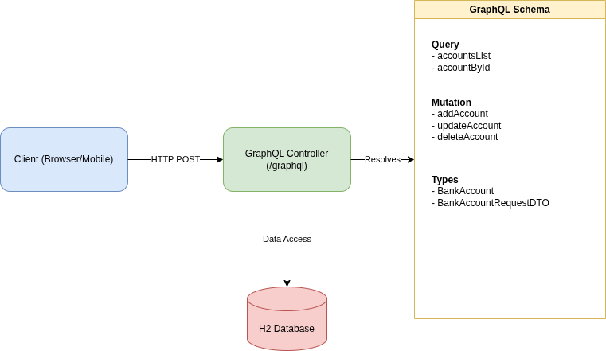

# Bank Account GraphQL Service

This is a Spring Boot application that provides a GraphQL API for managing bank accounts. It allows you to create, retrieve, update, and delete bank accounts using GraphQL queries and mutations.




## Technologies Used

*   **Java**: 17
*   **Framework**: Spring Boot
*   **API**: GraphQL (Spring for GraphQL)
*   **Database**: H2 Database (In-Memory)
*   **Tools**: Lombok, MapStruct

## Features

*   **GraphQL API**: Flexible data retrieval and manipulation.
*   **In-Memory Database**: Uses H2 for easy setup and testing. Data is reset on application restart.
*   **Console Access**: H2 Console enabled for direct database inspection.

## Getting Started

### Prerequisites

*   Java 17 or higher
*   Maven

### Installation

1.  Clone the repository:
    ```bash
    git clone <repository-url>
    ```
2.  Navigate to the project directory:
    ```bash
    cd Bank-Account-GraphQL-Service
    ```
3.  Build the project:
    ```bash
    mvn clean install
    ```

### Running the Application

Run the application using Maven:

```bash
mvn spring-boot:run
```

The application will start on port `8080` (default).

## GraphQL Usage

You can access the GraphQL interface (GraphiQL) at: `http://localhost:8080/graphiql` (if enabled) or send requests to the `/graphql` endpoint.

### Schema

#### Queries

*   **List all accounts**:
    ```graphql
    query {
      accountsList {
        id
        balance
        currency
        type
        createdAt
      }
    }
    ```

*   **Get account by ID**:
    ```graphql
    query {
      accountById(id: "PROJECT_ID") {
        balance
        currency
        type
      }
    }
    ```

#### Mutations

*   **Add a new account**:
    ```graphql
    mutation {
      addAccount(bankAccount: {
        balance: 1000.0,
        currency: "USD",
        type: "SAVINGS"
      }) {
        id
        balance
      }
    }
    ```

*   **Update an account**:
    ```graphql
    mutation {
      updateAccount(id: "ACCOUNT_ID", bankAccount: {
        balance: 2000.0,
        currency: "EUR",
        type: "CURRENT"
      }) {
        id
        balance
        currency
        type
      }
    }
    ```

*   **Delete an account**:
    ```graphql
    mutation {
      deleteAccount(id: "ACCOUNT_ID")
    }
    ```

## REST API

In addition to GraphQL, this service exposes a standard REST API.

### Endpoints

*   **List all accounts**:
    *   `GET /api/bankAccounts`
    *   Response: List of `BankAccountDTO`

*   **Get account by ID**:
    *   `GET /api/bankAccounts/{id}`
    *   Response: `BankAccountDTO`

*   **Create account**:
    *   `POST /api/bankAccounts`
    *   Body:
        ```json
        {
          "balance": 1000.0,
          "currency": "USD",
          "type": "SAVINGS"
        }
        ```
    *   Response: `BankAccountDTO`

*   **Update account**:
    *   `PUT /api/bankAccounts/{id}`
    *   Body:
        ```json
        {
          "balance": 1500.0,
          "currency": "EUR",
          "type": "CURRENT"
        }
        ```
    *   Response: `BankAccountDTO`

*   **Delete account**:
    *   `DELETE /api/bankAccounts/{id}`
    *   Response: `BankAccountDTO` (The deleted account details)

## H2 Console

To access the H2 database console:
1.  Go to `http://localhost:8080/h2-console`
2.  JDBC URL: `jdbc:h2:mem:testdb` (Default, check `application.properties` if different)
3.  User Name: `sa`
4.  Password: (Empty or check `application.properties`)
